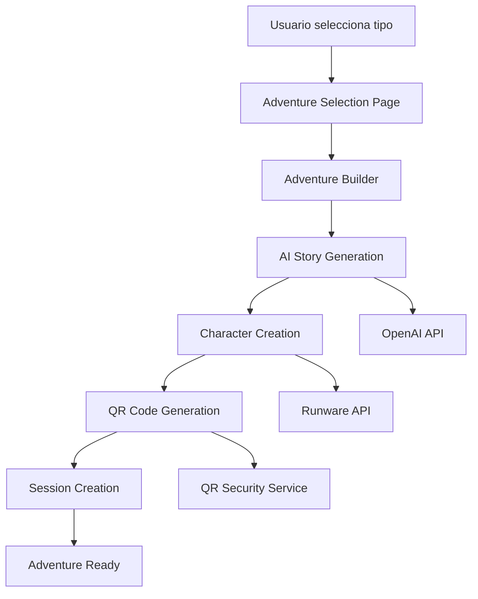
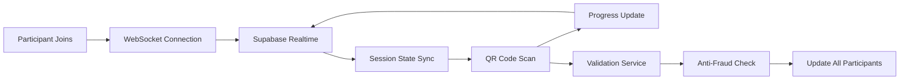

# ClueQuest - Documento de Diseño Técnico

**Versión:** 1.0  
**Fecha:** Enero 2025  
**Arquitecto:** Sistema de Producción Activo  
**Stack:** Next.js 15 + React 19 + Supabase + AI Integration

---

## 🏛 Arquitectura General

### Visión Arquitectural
ClueQuest implementa una arquitectura **serverless-first** con **edge computing**, **AI integration**, y **real-time collaboration**. El diseño prioriza **mobile-first performance**, **global scalability**, y **enterprise security**.

### Principios de Diseño
1. **Mobile-First**: Toda UI diseñada desde 375px hacia arriba
2. **AI-Native**: IA integrada en el core, no como add-on
3. **Security-First**: Zero trust, validation en cada capa
4. **Performance-Obsessed**: <200ms target para todas las operaciones
5. **Real-Time Ready**: Colaboración sincronizada por defecto

---

## 🏗 Stack Tecnológico Completo

### Frontend Layer
```typescript
// Core Framework
Next.js 15.1.6          // App Router, RSC, Edge Functions
React 19.1.0             // Concurrent features, Server Components  
TypeScript 5.7.2         // Strict mode, latest features

// UI & Styling
Tailwind CSS 3.4.17     // Mobile-first config, safe areas
Framer Motion 11.15.0   // GPU-accelerated animations
Radix UI Primitives     // Accessible component foundation

// State Management
TanStack Query 5.62.7   // Server state, optimistic updates
React Hook Form         // Form handling with Zod validation
Zustand (planeado)      // Client state para adventure session

// Developer Experience
ESLint 9.17.0           // Code quality enforcement
Prettier 3.4.2          // Code formatting
Bundle Analyzer         // Performance monitoring
```

### Backend Infrastructure
```yaml
# Database & Auth
Supabase PostgreSQL:
  version: "15.4"
  features: ["Row Level Security", "Realtime", "Storage"]
  optimization: "25+ custom indexes, RPC functions"

# Real-time Engine
Supabase Realtime:
  protocol: "WebSockets"
  features: ["Presence", "Broadcast", "Database Changes"]
  
# File Storage
Supabase Storage:
  buckets: ["avatars", "adventure-images", "qr-codes"]
  policies: "RLS-protected per adventure"
```

### AI Services Architecture
```yaml
# Content Generation
OpenAI Integration:
  model: "GPT-4"
  endpoints: ["/api/ai/story-generator", "/api/ai/character-generator"]
  rate_limiting: "100 requests/hour per user"
  
# Avatar Generation  
Runware API:
  endpoint: "/api/ai/avatar/generate"
  response_time: "<10 seconds"
  formats: ["PNG", "WebP optimized"]

# Knowledge Base
Custom RAG System:
  embeddings: "OpenAI text-embedding-3-small"  
  vector_store: "Supabase pgvector extension"
  similarity_search: "Cosine similarity > 0.85"
```

### Infrastructure & DevOps
```yaml
# Hosting & CDN
Vercel:
  regions: ["Global Edge Network"]
  functions: ["Serverless", "Edge Functions"]
  
Cloudflare:
  services: ["DNS", "CDN", "DDoS Protection"]
  optimization: ["Auto-minification", "Image optimization"]

# Monitoring & Analytics
Sentry: "Error tracking + Performance monitoring"
Vercel Analytics: "Real user metrics"
Custom Metrics: "Adventure completion rates, AI costs"
```

---

## 📊 Arquitectura de Datos

### Database Schema (Supabase PostgreSQL)

#### Core Tables
```sql
-- User Management
cluequest_profiles (
  id UUID PRIMARY KEY REFERENCES auth.users(id),
  name TEXT,
  email TEXT,
  avatar_url TEXT,
  timezone TEXT DEFAULT 'UTC',
  created_at TIMESTAMPTZ DEFAULT NOW()
);

-- Adventure System
cluequest_adventures (
  id UUID PRIMARY KEY DEFAULT gen_random_uuid(),
  title TEXT NOT NULL,
  theme TEXT NOT NULL, -- 'corporate' | 'educational' | 'social' | 'mystery' | 'hacker'
  description TEXT,
  story_content JSONB, -- AI-generated story
  created_by UUID REFERENCES cluequest_profiles(id),
  settings JSONB DEFAULT '{}',
  created_at TIMESTAMPTZ DEFAULT NOW()
);

-- Session Management
cluequest_sessions (
  id UUID PRIMARY KEY DEFAULT gen_random_uuid(),
  adventure_id UUID REFERENCES cluequest_adventures(id),
  session_code TEXT UNIQUE NOT NULL, -- 6-digit join code
  status TEXT DEFAULT 'waiting', -- 'waiting' | 'active' | 'completed'
  max_participants INTEGER DEFAULT 8,
  current_participants INTEGER DEFAULT 0,
  started_at TIMESTAMPTZ,
  completed_at TIMESTAMPTZ,
  created_at TIMESTAMPTZ DEFAULT NOW()
);

-- Real-time Collaboration
cluequest_participants (
  id UUID PRIMARY KEY DEFAULT gen_random_uuid(),
  session_id UUID REFERENCES cluequest_sessions(id),
  user_id UUID REFERENCES cluequest_profiles(id),
  role TEXT, -- Player role within adventure
  avatar_data JSONB, -- AI-generated avatar info
  progress JSONB DEFAULT '{}',
  joined_at TIMESTAMPTZ DEFAULT NOW()
);

-- QR Code System
cluequest_qr_codes (
  id UUID PRIMARY KEY DEFAULT gen_random_uuid(),
  session_id UUID REFERENCES cluequest_sessions(id),
  sequence_number INTEGER NOT NULL,
  qr_token TEXT UNIQUE NOT NULL, -- Encrypted payload
  location_hint TEXT,
  challenge_data JSONB,
  expires_at TIMESTAMPTZ NOT NULL,
  scanned_at TIMESTAMPTZ,
  scanned_by UUID REFERENCES cluequest_participants(id),
  created_at TIMESTAMPTZ DEFAULT NOW()
);

-- AI-Generated Content
cluequest_ai_content (
  id UUID PRIMARY KEY DEFAULT gen_random_uuid(),
  adventure_id UUID REFERENCES cluequest_adventures(id),
  content_type TEXT NOT NULL, -- 'story' | 'character' | 'challenge' | 'avatar'
  ai_service TEXT NOT NULL, -- 'openai' | 'runware'
  prompt_used TEXT,
  generated_content JSONB,
  generation_cost DECIMAL(10,4), -- Track AI costs
  created_at TIMESTAMPTZ DEFAULT NOW()
);
```

#### Performance Optimizations
```sql
-- Strategic Indexes (25+ implementados)
CREATE INDEX CONCURRENTLY idx_adventures_theme_created 
ON cluequest_adventures(theme, created_at DESC);

CREATE INDEX CONCURRENTLY idx_sessions_active_lookup 
ON cluequest_sessions(status, created_at DESC) 
WHERE status IN ('waiting', 'active');

CREATE INDEX CONCURRENTLY idx_participants_session_progress 
ON cluequest_participants(session_id, progress);

CREATE INDEX CONCURRENTLY idx_qr_codes_session_sequence 
ON cluequest_qr_codes(session_id, sequence_number);

-- Partial Indexes para queries específicas
CREATE INDEX CONCURRENTLY idx_qr_active_tokens
ON cluequest_qr_codes(qr_token, expires_at) 
WHERE expires_at > NOW() AND scanned_at IS NULL;
```

#### RPC Functions para Performance
```sql
-- Optimized Dashboard Data (elimina N+1 queries)
CREATE OR REPLACE FUNCTION get_adventure_dashboard_data(
  p_user_id UUID
) RETURNS JSONB AS $$
BEGIN
  RETURN (
    WITH user_adventures AS (
      SELECT id, title, theme, created_at, settings
      FROM cluequest_adventures 
      WHERE created_by = p_user_id 
      ORDER BY created_at DESC LIMIT 10
    ),
    active_sessions AS (
      SELECT session_id, COUNT(*) as participant_count
      FROM cluequest_participants 
      WHERE session_id IN (
        SELECT id FROM cluequest_sessions WHERE status = 'active'
      )
      GROUP BY session_id
    )
    SELECT jsonb_build_object(
      'adventures', (SELECT jsonb_agg(row_to_json(user_adventures)) FROM user_adventures),
      'active_sessions', (SELECT jsonb_agg(row_to_json(active_sessions)) FROM active_sessions)
    )
  );
END;
$$ LANGUAGE plpgsql;

-- Real-time Session Progress
CREATE OR REPLACE FUNCTION get_session_progress(
  p_session_id UUID
) RETURNS JSONB AS $$
BEGIN
  RETURN (
    SELECT jsonb_build_object(
      'participants', (
        SELECT jsonb_agg(
          jsonb_build_object(
            'id', id,
            'role', role,
            'progress', progress,
            'avatar_data', avatar_data
          )
        )
        FROM cluequest_participants 
        WHERE session_id = p_session_id
      ),
      'qr_progress', (
        SELECT jsonb_build_object(
          'total_qr_codes', COUNT(*),
          'scanned_codes', COUNT(scanned_at),
          'current_sequence', COALESCE(MAX(sequence_number), 0)
        )
        FROM cluequest_qr_codes 
        WHERE session_id = p_session_id
      )
    )
  );
END;
$$ LANGUAGE plpgsql;
```

### Row Level Security (RLS) Policies
```sql
-- Aventuras: usuarios ven solo las suyas y públicas
CREATE POLICY "Users can view own adventures" ON cluequest_adventures
  FOR SELECT USING (
    created_by = auth.uid() OR 
    settings->>'visibility' = 'public'
  );

CREATE POLICY "Users can create adventures" ON cluequest_adventures
  FOR INSERT WITH CHECK (created_by = auth.uid());

-- Sesiones: participantes pueden ver su sesión activa
CREATE POLICY "Participants can view their sessions" ON cluequest_sessions
  FOR SELECT USING (
    id IN (
      SELECT session_id FROM cluequest_participants 
      WHERE user_id = auth.uid()
    )
  );

-- QR Codes: solo participantes de la sesión
CREATE POLICY "Session participants can access QR codes" ON cluequest_qr_codes
  FOR SELECT USING (
    session_id IN (
      SELECT session_id FROM cluequest_participants 
      WHERE user_id = auth.uid()
    )
  );
```

---

## 🔄 Flujo de Datos y Arquitectura de Estados

### Adventure Creation Flow


### Real-time Adventure Session


### State Management Architecture
```typescript
// Adventure Session State (Zustand)
interface AdventureSessionStore {
  // Session Info
  sessionId: string | null
  sessionCode: string | null
  status: 'waiting' | 'active' | 'completed'
  
  // Participants
  participants: Participant[]
  currentUser: Participant | null
  
  // Progress Tracking
  currentQrSequence: number
  totalQrCodes: number
  completedChallenges: Challenge[]
  
  // Real-time Updates
  lastUpdate: Date
  isConnected: boolean
  
  // Actions
  joinSession: (code: string) => Promise<void>
  scanQrCode: (token: string) => Promise<void>
  updateProgress: (progress: Progress) => void
  subscribeToUpdates: () => void
}

// Server State (TanStack Query)
const adventureQueries = {
  session: (sessionId: string) => ({
    queryKey: ['session', sessionId],
    queryFn: () => getSessionData(sessionId),
    refetchInterval: 5000, // Poll every 5s for updates
  }),
  
  qrCodes: (sessionId: string) => ({
    queryKey: ['qrCodes', sessionId],
    queryFn: () => getQrCodes(sessionId),
    staleTime: 1000 * 60 * 10, // 10 minutes
  }),
  
  aiContent: (adventureId: string) => ({
    queryKey: ['aiContent', adventureId],
    queryFn: () => getAiGeneratedContent(adventureId),
    staleTime: Infinity, // AI content rarely changes
  })
}
```

---

## 🤖 AI Integration Architecture

### Content Generation Pipeline
```typescript
// Story Generation Service
class StoryGenerationService {
  async generateStory(theme: AdventureTheme, settings: StorySettings) {
    const prompt = this.buildStoryPrompt(theme, settings);
    
    const response = await openai.chat.completions.create({
      model: "gpt-4",
      messages: [
        { role: "system", content: this.getSystemPrompt(theme) },
        { role: "user", content: prompt }
      ],
      temperature: 0.8, // Creative but consistent
      max_tokens: 2000,
    });
    
    return this.parseStoryResponse(response.choices[0].message.content);
  }
  
  private buildStoryPrompt(theme: AdventureTheme, settings: StorySettings): string {
    return `
      Create an interactive adventure story with the following requirements:
      - Theme: ${theme}
      - Duration: ${settings.duration} minutes
      - Participants: ${settings.participantCount}
      - Difficulty: ${settings.difficulty}
      
      Include:
      - Compelling narrative hook
      - 3-5 major story beats
      - Character roles for participants
      - Location-based challenges
      - Satisfying resolution
      
      Format as structured JSON with acts, challenges, and character descriptions.
    `;
  }
}

// Avatar Generation Service  
class AvatarGenerationService {
  async generateAvatar(characterRole: string, theme: AdventureTheme) {
    const prompt = this.buildAvatarPrompt(characterRole, theme);
    
    const response = await fetch('https://api.runware.ai/v1/images/generate', {
      method: 'POST',
      headers: {
        'Authorization': `Bearer ${RUNWARE_API_KEY}`,
        'Content-Type': 'application/json'
      },
      body: JSON.stringify({
        prompt,
        model: "runware:100@1",
        steps: 20,
        width: 512,
        height: 512,
        outputFormat: "PNG"
      })
    });
    
    return this.optimizeForMobile(await response.json());
  }
}
```

### Knowledge Base RAG System
```typescript
// Knowledge Base Integration
class KnowledgeBaseService {
  async ingestDocument(filePath: string, title: string) {
    // 1. Extract text from PDF
    const content = await this.extractTextFromPDF(filePath);
    
    // 2. Chunk content for embeddings
    const chunks = this.chunkContent(content, 500); // 500 char chunks
    
    // 3. Generate embeddings
    const embeddings = await Promise.all(
      chunks.map(chunk => this.generateEmbedding(chunk))
    );
    
    // 4. Store in Supabase with pgvector
    await this.storeEmbeddings(title, chunks, embeddings);
  }
  
  async semanticSearch(query: string, limit = 5) {
    const queryEmbedding = await this.generateEmbedding(query);
    
    const { data } = await supabase
      .rpc('semantic_search', {
        query_embedding: queryEmbedding,
        similarity_threshold: 0.8,
        match_count: limit
      });
      
    return data;
  }
  
  async checkOriginality(content: string, threshold = 0.85) {
    const contentEmbedding = await this.generateEmbedding(content);
    
    const similarContent = await this.semanticSearch(content, 10);
    const maxSimilarity = Math.max(...similarContent.map(s => s.similarity));
    
    return {
      isOriginal: maxSimilarity < threshold,
      similarityScore: maxSimilarity,
      similarContent: similarContent
    };
  }
}
```

---

## 🔐 Sistema de Seguridad QR

### Generación Segura de QR Codes
```typescript
class SecureQRService {
  async generateQRCode(sessionId: string, sequence: number, location?: string) {
    // 1. Create encrypted payload
    const payload = {
      sessionId,
      sequence,
      location,
      timestamp: Date.now(),
      expires: Date.now() + (15 * 60 * 1000) // 15 minutes
    };
    
    // 2. Encrypt with session-specific key
    const token = await this.encryptPayload(payload, sessionId);
    
    // 3. Generate QR with validation endpoint
    const qrContent = `${APP_URL}/api/qr/scan?token=${token}`;
    
    // 4. Store in database for validation
    await supabase.from('cluequest_qr_codes').insert({
      session_id: sessionId,
      sequence_number: sequence,
      qr_token: token,
      location_hint: location,
      expires_at: new Date(payload.expires)
    });
    
    return this.generateQRImage(qrContent);
  }
  
  async validateQRScan(token: string, userId: string) {
    // 1. Verify token hasn't expired
    const { data: qrCode } = await supabase
      .from('cluequest_qr_codes')
      .select('*')
      .eq('qr_token', token)
      .gt('expires_at', new Date())
      .is('scanned_at', null)
      .single();
      
    if (!qrCode) {
      throw new Error('QR code expired or already used');
    }
    
    // 2. Verify user is participant in session
    const { data: participant } = await supabase
      .from('cluequest_participants')
      .select('*')
      .eq('session_id', qrCode.session_id)
      .eq('user_id', userId)
      .single();
      
    if (!participant) {
      throw new Error('User not authorized for this session');
    }
    
    // 3. Verify sequence order (anti-skip protection)
    const lastScanned = await this.getLastScannedSequence(qrCode.session_id, userId);
    if (qrCode.sequence_number !== lastScanned + 1) {
      throw new Error('QR codes must be scanned in order');
    }
    
    // 4. Mark as scanned and update progress
    await this.markQRScanned(qrCode.id, userId);
    await this.updateParticipantProgress(participant.id, qrCode.sequence_number);
    
    return qrCode.challenge_data;
  }
}
```

### Anti-Fraud System
```typescript
class AntiFraudService {
  async validateScanAttempt(sessionId: string, userId: string, location?: GeolocationPosition) {
    // Rate limiting per user
    const recentScans = await this.getRecentScans(userId, 60000); // Last minute
    if (recentScans.length > 5) {
      throw new FraudError('Too many scan attempts');
    }
    
    // Location validation (if GPS available)
    if (location) {
      const expectedLocation = await this.getExpectedLocation(sessionId);
      const distance = this.calculateDistance(location, expectedLocation);
      if (distance > 100) { // 100 meters tolerance
        await this.logSuspiciousActivity('location_mismatch', { userId, sessionId, distance });
      }
    }
    
    // Behavioral analysis
    const scanPattern = await this.analyzeScanPattern(userId, sessionId);
    if (scanPattern.suspiciousScore > 0.8) {
      await this.flagForReview(userId, sessionId, scanPattern);
    }
    
    return { validated: true, riskScore: scanPattern.suspiciousScore };
  }
  
  private async analyzeScanPattern(userId: string, sessionId: string) {
    const scans = await this.getUserScansInSession(userId, sessionId);
    
    // Check for inhuman scan speeds
    const scanIntervals = scans.map((scan, i) => 
      i > 0 ? scan.scanned_at - scans[i-1].scanned_at : 0
    );
    
    const averageInterval = scanIntervals.reduce((a, b) => a + b, 0) / scanIntervals.length;
    const tooFast = averageInterval < 30000; // Less than 30 seconds per QR
    
    // Check for perfect sequence (suspicious in real scenarios)  
    const perfectSequence = scans.every((scan, i) => scan.sequence_number === i + 1);
    
    return {
      suspiciousScore: (tooFast ? 0.5 : 0) + (perfectSequence && scans.length > 3 ? 0.4 : 0),
      factors: { tooFast, perfectSequence, averageInterval }
    };
  }
}
```

---

## 📱 Mobile-First Design System

### Responsive Breakpoints
```typescript
// Tailwind Config - Mobile-First
const theme = {
  screens: {
    'xs': '375px',   // iPhone SE
    'sm': '640px',   // Large phones
    'md': '768px',   // Tablets
    'lg': '1024px',  // Laptops
    'xl': '1280px',  // Desktop
    '2xl': '1536px'  // Large desktop
  },
  
  // Safe Area Support
  spacing: {
    'safe-top': 'env(safe-area-inset-top)',
    'safe-bottom': 'env(safe-area-inset-bottom)',
    'safe-left': 'env(safe-area-inset-left)',
    'safe-right': 'env(safe-area-inset-right)'
  }
}
```

### Touch Target System
```css
/* Touch-Friendly Components */
.touch-target {
  @apply min-h-[44px] min-w-[44px]; /* WCAG AA minimum */
  touch-action: manipulation; /* Prevent zoom on tap */
}

.touch-target-large {
  @apply min-h-[56px] min-w-[56px]; /* Primary actions */
}

/* Button Hierarchy */
.btn-primary {
  @apply touch-target-large px-8 py-4 rounded-2xl;
  @apply bg-gradient-to-r from-amber-500 to-orange-600;
  @apply text-white font-bold text-lg;
  @apply shadow-2xl hover:shadow-amber-500/40;
  @apply transition-all duration-300 hover:scale-105;
  @apply active:scale-95; /* Touch feedback */
}

.btn-secondary {
  @apply touch-target bg-slate-800/90 px-6 py-3 rounded-xl;
  @apply text-amber-200 ring-2 ring-amber-500/40;
  @apply backdrop-blur-xl border border-amber-500/30;
}
```

### Perfect Modal Centering (ClueQuest Pattern)
```css
/* Flexbox Modal System - Works on ALL screen sizes */
.modal-container {
  @apply fixed inset-0 z-50;
  @apply flex items-center justify-center;
  @apply p-4 sm:p-6 lg:p-8;
  
  /* Safe area support for notched devices */
  padding-top: max(1rem, env(safe-area-inset-top));
  padding-bottom: max(1rem, env(safe-area-inset-bottom));
  padding-left: max(1rem, env(safe-area-inset-left));
  padding-right: max(1rem, env(safe-area-inset-right));
}

.modal-content {
  @apply w-full max-w-lg max-h-full overflow-auto;
  @apply bg-slate-900/95 backdrop-blur-2xl;
  @apply rounded-3xl border border-amber-500/30;
  @apply shadow-2xl;
}

/* NEVER use transform: translate(-50%, -50%) - causes issues */
```

### Animation System
```typescript
// GPU-Accelerated Animations
const animations = {
  // Page transitions
  pageEnter: {
    initial: { opacity: 0, y: 20 },
    animate: { opacity: 1, y: 0 },
    transition: { duration: 0.6, ease: "easeOut" }
  },
  
  // Card hover effects
  cardHover: {
    whileHover: { 
      scale: 1.02,
      rotateY: 2,
      transition: { duration: 0.2 }
    },
    whileTap: { scale: 0.98 }
  },
  
  // QR scan feedback
  qrScanSuccess: {
    scale: [1, 1.2, 1],
    rotate: [0, 360],
    transition: { duration: 0.8, ease: "backOut" }
  }
}

// Optimized for mobile performance
const motionConfig = {
  // Reduce motion on low-end devices
  reduceMotion: "user",
  
  // Use GPU acceleration
  style: {
    transformOrigin: "center",
    willChange: "transform, opacity"
  }
}
```

---

## ⚡ Performance Architecture

### Bundle Optimization
```javascript
// next.config.js - Production-Ready
const nextConfig = {
  // Chunk splitting for optimal loading
  webpack: (config, { dev, isServer }) => {
    if (!dev && !isServer) {
      config.optimization.splitChunks = {
        chunks: 'all',
        cacheGroups: {
          // Vendor libraries
          vendor: {
            test: /[\\/]node_modules[\\/]/,
            name: 'vendors',
            priority: -10,
            chunks: 'all',
          },
          
          // Supabase chunk (large dependency)
          supabase: {
            test: /[\\/]node_modules[\\/]@supabase/,
            name: 'supabase',
            priority: 10,
            chunks: 'all',
          },
          
          // UI components
          ui: {
            test: /[\\/]node_modules[\\/]@radix-ui/,
            name: 'ui',
            priority: 10,
            chunks: 'all',
          },
          
          // AI services (loaded on demand)
          ai: {
            test: /[\\/]src[\\/]lib[\\/](openai|runware)/,
            name: 'ai-services',
            priority: 15,
            chunks: 'async', // Only load when needed
          }
        },
      };
    }
    return config;
  },
  
  // Image optimization
  images: {
    domains: ['images.unsplash.com', 'avatars.githubusercontent.com'],
    formats: ['image/webp', 'image/avif'],
    deviceSizes: [640, 750, 828, 1080, 1200, 1920],
    imageSizes: [16, 32, 48, 64, 96, 128, 256, 384],
  },
  
  // Compression and headers
  compress: true,
  poweredByHeader: false,
};
```

### Caching Strategy
```typescript
// Multi-Level Caching System
class CacheManager {
  // 1. Browser Cache (React Query)
  queryClient = new QueryClient({
    defaultOptions: {
      queries: {
        staleTime: 1000 * 60 * 5, // 5 minutes
        cacheTime: 1000 * 60 * 30, // 30 minutes
        retry: (failureCount, error) => {
          // Don't retry on auth errors
          if (error?.status === 401) return false;
          return failureCount < 3;
        }
      }
    }
  });
  
  // 2. Service Worker Cache (para contenido estático)
  async cacheStaticAssets() {
    const cache = await caches.open('cluequest-v1');
    await cache.addAll([
      '/',
      '/adventure-selection',
      '/builder',
      // Static assets
      '/images/adventure-profiles/',
      '/fonts/',
    ]);
  }
  
  // 3. CDN Cache (Vercel + Cloudflare)
  static getCacheHeaders(type: 'static' | 'dynamic' | 'api') {
    switch (type) {
      case 'static':
        return 'public, max-age=31536000, immutable'; // 1 year
      case 'dynamic':  
        return 'public, max-age=300, s-maxage=3600'; // 5min browser, 1hr CDN
      case 'api':
        return 'private, no-cache'; // No caching for personalized data
    }
  }
}

// Database Query Optimization
const optimizedQueries = {
  // Use RPC functions para complex joins
  dashboardData: () => supabase.rpc('get_adventure_dashboard_data'),
  
  // Paginated lists with cursor-based pagination  
  adventuresList: (cursor?: string) => 
    supabase
      .from('cluequest_adventures')
      .select('id, title, theme, created_at')
      .order('created_at', { ascending: false })
      .limit(20)
      .gt('created_at', cursor || '1970-01-01'),
      
  // Optimistic updates para real-time features
  updateProgress: async (participantId: string, progress: any) => {
    // Update local state immediately
    queryClient.setQueryData(['participant', participantId], (old: any) => ({
      ...old,
      progress
    }));
    
    // Send to server
    const result = await supabase
      .from('cluequest_participants')
      .update({ progress })
      .eq('id', participantId);
      
    if (result.error) {
      // Revert on error
      queryClient.invalidateQueries(['participant', participantId]);
    }
    
    return result;
  }
};
```

---

## 🔄 Real-Time Architecture

### Supabase Realtime Integration
```typescript
class RealtimeManager {
  private supabase = createClient(SUPABASE_URL, SUPABASE_ANON_KEY);
  private subscriptions = new Map<string, RealtimeChannel>();
  
  // Session-wide real-time updates
  subscribeToSession(sessionId: string, callbacks: SessionCallbacks) {
    const channel = this.supabase
      .channel(`session:${sessionId}`)
      .on(
        'postgres_changes',
        {
          event: '*',
          schema: 'public',
          table: 'cluequest_participants',
          filter: `session_id=eq.${sessionId}`
        },
        callbacks.onParticipantChange
      )
      .on(
        'postgres_changes',
        {
          event: 'UPDATE',
          schema: 'public', 
          table: 'cluequest_qr_codes',
          filter: `session_id=eq.${sessionId}`
        },
        callbacks.onQRScanned
      )
      .on('broadcast', { event: 'progress_update' }, callbacks.onProgressUpdate)
      .on('presence', { event: 'sync' }, callbacks.onPresenceSync)
      .subscribe();
      
    this.subscriptions.set(sessionId, channel);
    return channel;
  }
  
  // Broadcast progress to all session participants
  async broadcastProgress(sessionId: string, progress: ProgressUpdate) {
    const channel = this.subscriptions.get(sessionId);
    if (channel) {
      await channel.send({
        type: 'broadcast',
        event: 'progress_update',
        payload: progress
      });
    }
  }
  
  // Track participant presence (online/offline)
  async trackPresence(sessionId: string, participantId: string) {
    const channel = this.subscriptions.get(sessionId);
    if (channel) {
      await channel.track({
        participant_id: participantId,
        online_at: new Date().toISOString(),
        status: 'active'
      });
    }
  }
  
  cleanup(sessionId: string) {
    const channel = this.subscriptions.get(sessionId);
    if (channel) {
      channel.unsubscribe();
      this.subscriptions.delete(sessionId);
    }
  }
}

// React Hook for session real-time updates
function useSessionRealtime(sessionId: string) {
  const [participants, setParticipants] = useState<Participant[]>([]);
  const [qrProgress, setQrProgress] = useState<QRProgress>({});
  const [presenceState, setPresenceState] = useState<PresenceState>({});
  
  useEffect(() => {
    if (!sessionId) return;
    
    const realtimeManager = new RealtimeManager();
    
    const channel = realtimeManager.subscribeToSession(sessionId, {
      onParticipantChange: (payload) => {
        setParticipants(current => 
          updateParticipantInList(current, payload.new)
        );
      },
      
      onQRScanned: (payload) => {
        setQrProgress(current => ({
          ...current,
          [payload.new.sequence_number]: payload.new
        }));
      },
      
      onProgressUpdate: (payload) => {
        // Handle broadcast progress updates
        setParticipants(current =>
          current.map(p => 
            p.id === payload.participant_id 
              ? { ...p, progress: payload.progress }
              : p
          )
        );
      },
      
      onPresenceSync: () => {
        const state = channel.presenceState();
        setPresenceState(state);
      }
    });
    
    return () => realtimeManager.cleanup(sessionId);
  }, [sessionId]);
  
  return { participants, qrProgress, presenceState };
}
```

---

## 🛡 Security Implementation

### API Route Security
```typescript
// Middleware para rate limiting y validación
export async function middleware(request: NextRequest) {
  // Rate limiting por IP
  const ip = request.ip ?? '127.0.0.1';
  const { success, limit, reset, remaining } = await ratelimit.limit(ip);
  
  if (!success) {
    return new Response('Too Many Requests', { 
      status: 429,
      headers: {
        'X-RateLimit-Limit': limit.toString(),
        'X-RateLimit-Remaining': remaining.toString(),
        'X-RateLimit-Reset': new Date(reset).toISOString()
      }
    });
  }
  
  // Security headers
  const response = NextResponse.next();
  response.headers.set('X-Frame-Options', 'DENY');
  response.headers.set('X-Content-Type-Options', 'nosniff');
  response.headers.set('Referrer-Policy', 'strict-origin-when-cross-origin');
  
  return response;
}

// API Route Protection Pattern
export async function POST(request: Request) {
  try {
    // 1. Authentication check
    const token = request.headers.get('Authorization')?.replace('Bearer ', '');
    const user = await validateJWTToken(token);
    if (!user) {
      return NextResponse.json({ error: 'Unauthorized' }, { status: 401 });
    }
    
    // 2. Input validation with Zod
    const body = await request.json();
    const validatedData = APISchema.parse(body);
    
    // 3. Authorization check (RLS handles most, but extra checks for sensitive operations)
    if (validatedData.sessionId) {
      const canAccess = await checkSessionAccess(user.id, validatedData.sessionId);
      if (!canAccess) {
        return NextResponse.json({ error: 'Forbidden' }, { status: 403 });
      }
    }
    
    // 4. Business logic
    const result = await processRequest(validatedData, user);
    
    // 5. Audit logging for sensitive operations
    await auditLog({
      userId: user.id,
      action: 'api_call',
      resource: request.url,
      metadata: { sessionId: validatedData.sessionId }
    });
    
    return NextResponse.json(result);
    
  } catch (error) {
    // Error handling con Sentry
    Sentry.captureException(error);
    
    if (error instanceof ZodError) {
      return NextResponse.json(
        { error: 'Invalid input', details: error.errors },
        { status: 400 }
      );
    }
    
    return NextResponse.json(
      { error: 'Internal server error' },
      { status: 500 }
    );
  }
}
```

### Input Validation Schemas
```typescript
// Comprehensive Zod schemas
const AdventureCreationSchema = z.object({
  title: z.string().min(3).max(100),
  theme: z.enum(['corporate', 'educational', 'social', 'mystery', 'hacker']),
  description: z.string().max(500).optional(),
  settings: z.object({
    duration: z.number().int().min(15).max(240), // 15-240 minutes
    maxParticipants: z.number().int().min(2).max(20),
    difficulty: z.enum(['easy', 'medium', 'hard']),
    requiresLocation: z.boolean().default(false)
  }),
  aiGeneration: z.object({
    generateStory: z.boolean().default(true),
    generateCharacters: z.boolean().default(true),
    customPrompt: z.string().max(1000).optional()
  }).optional()
});

const QRScanSchema = z.object({
  token: z.string().min(10),
  location: z.object({
    latitude: z.number().min(-90).max(90),
    longitude: z.number().min(-180).max(180),
    accuracy: z.number().positive()
  }).optional(),
  deviceInfo: z.object({
    userAgent: z.string().max(500),
    timestamp: z.string().datetime(),
    timezone: z.string()
  })
});

const SessionJoinSchema = z.object({
  sessionCode: z.string().length(6).regex(/^[A-Z0-9]{6}$/),
  participantName: z.string().min(2).max(50),
  selectedRole: z.string().max(100).optional()
});
```

---

## 📈 Monitoring y Analytics

### Performance Monitoring
```typescript
// Custom Performance Metrics
class PerformanceMonitor {
  // Web Vitals tracking
  static trackWebVitals() {
    getCLS((metric) => this.sendToAnalytics('CLS', metric.value));
    getFID((metric) => this.sendToAnalytics('FID', metric.value));
    getFCP((metric) => this.sendToAnalytics('FCP', metric.value));
    getLCP((metric) => this.sendToAnalytics('LCP', metric.value));
    getTTFB((metric) => this.sendToAnalytics('TTFB', metric.value));
  }
  
  // Business Metrics
  static trackAdventureMetrics(event: string, data: any) {
    const metrics = {
      // Adventure completion funnel
      'adventure_created': { adventureId: data.id, theme: data.theme },
      'session_started': { sessionId: data.id, participantCount: data.participants },
      'qr_scanned': { sessionId: data.sessionId, sequence: data.sequence },
      'adventure_completed': { sessionId: data.id, duration: data.duration },
      
      // AI usage metrics
      'story_generated': { theme: data.theme, tokens: data.tokens, cost: data.cost },
      'avatar_generated': { role: data.role, generationTime: data.time },
      
      // User engagement
      'user_returned': { userId: data.userId, daysSinceLastVisit: data.days },
      'session_duration': { sessionId: data.sessionId, duration: data.duration }
    };
    
    // Send to multiple analytics services
    this.sendToVercelAnalytics(event, metrics[event]);
    this.sendToCustomAnalytics(event, metrics[event]);
  }
  
  // Database Performance Monitoring
  static async monitorQuery(queryName: string, queryFn: () => Promise<any>) {
    const startTime = performance.now();
    
    try {
      const result = await queryFn();
      const duration = performance.now() - startTime;
      
      // Log slow queries
      if (duration > 1000) { // > 1 second
        console.warn(`Slow query detected: ${queryName} took ${duration}ms`);
        Sentry.addBreadcrumb({
          message: 'Slow database query',
          data: { queryName, duration },
          level: 'warning'
        });
      }
      
      // Track query performance
      this.sendToAnalytics('database_query', {
        queryName,
        duration,
        success: true
      });
      
      return result;
    } catch (error) {
      const duration = performance.now() - startTime;
      
      this.sendToAnalytics('database_query', {
        queryName,
        duration,
        success: false,
        error: error.message
      });
      
      throw error;
    }
  }
}

// Real-time Dashboard Metrics
const dashboardMetrics = {
  // Live adventure sessions
  activeSessions: () => supabase
    .from('cluequest_sessions')
    .select('count')
    .eq('status', 'active'),
    
  // AI generation costs (daily)
  dailyAICosts: () => supabase
    .from('cluequest_ai_content') 
    .select('sum(generation_cost)')
    .gte('created_at', new Date().toISOString().split('T')[0]),
    
  // Performance metrics
  averageResponseTime: () => supabase.rpc('get_average_response_time'),
  
  // User engagement
  dailyActiveUsers: () => supabase.rpc('get_daily_active_users')
};
```

---

## 🔧 Development & Deployment

### Local Development Setup
```bash
# 1. Clone and install
git clone https://github.com/yourorg/cluequest
cd cluequest
npm install

# 2. Environment setup
cp .env.local.example .env.local
# Edit .env.local with your keys

# 3. Database setup
npm run db:migrate
npm run db:optimize  # Deploy performance indexes

# 4. Start development
npm run dev  # Starts on http://localhost:3000

# 5. Run tests
npm run test:e2e     # Playwright E2E tests
npm run test:auth    # Authentication flow tests
npm run test:avatar  # AI avatar generation tests
```

### Production Deployment Architecture
```yaml
# Vercel Configuration
vercel.json:
  regions: ["iad1", "fra1", "hnd1"]  # Global edge deployment
  functions:
    "src/app/api/**": 
      memory: 1024  # Increased for AI operations
      maxDuration: 30  # AI generation can take time
  
# Environment Variables (Production)
env_production:
  NODE_ENV: "production"
  NEXT_PUBLIC_APP_URL: "https://cluequest.empleaido.com"
  SUPABASE_URL: "https://[project].supabase.co"
  OPENAI_API_KEY: "[encrypted]"
  RUNWARE_API_KEY: "[encrypted]"
  RESEND_API_KEY: "[encrypted]"
  
# Monitoring Setup
monitoring:
  sentry_dsn: "[error tracking]"
  vercel_analytics: "enabled"
  custom_metrics: "enabled"
```

### CI/CD Pipeline
```yaml
# GitHub Actions Workflow
name: ClueQuest CI/CD
on:
  push:
    branches: [main, develop]
  pull_request:
    branches: [main]

jobs:
  test:
    runs-on: ubuntu-latest
    steps:
      - uses: actions/checkout@v3
      - uses: actions/setup-node@v3
        with:
          node-version: '18'
          
      - name: Install dependencies
        run: npm ci
        
      - name: Type checking
        run: npm run type-check
        
      - name: Linting
        run: npm run lint
        
      - name: Unit tests
        run: npm run test
        
      - name: Build application
        run: npm run build
        
      - name: E2E tests
        run: npm run test:e2e
        env:
          PLAYWRIGHT_BASE_URL: http://localhost:3000
          
      - name: Security audit
        run: npm run security:audit
        
  deploy:
    needs: test
    runs-on: ubuntu-latest
    if: github.ref == 'refs/heads/main'
    steps:
      - name: Deploy to Vercel
        uses: amondnet/vercel-action@v25
        with:
          vercel-token: ${{ secrets.VERCEL_TOKEN }}
          vercel-org-id: ${{ secrets.VERCEL_ORG_ID }}
          vercel-project-id: ${{ secrets.VERCEL_PROJECT_ID }}
```

---

## 📋 Consideraciones de Escalabilidad

### Database Scaling Plan
```sql
-- Partitioning para grandes volúmenes de datos
CREATE TABLE cluequest_sessions_y2025m01 PARTITION OF cluequest_sessions
    FOR VALUES FROM ('2025-01-01') TO ('2025-02-01');

-- Read replicas para analíticas
CREATE PUBLICATION cluequest_analytics FOR TABLE 
    cluequest_sessions, 
    cluequest_participants, 
    cluequest_qr_codes;

-- Archival strategy para datos antiguos
CREATE OR REPLACE FUNCTION archive_old_sessions()
RETURNS INTEGER AS $$
DECLARE
    archived_count INTEGER;
BEGIN
    -- Move completed sessions older than 90 days to archive
    WITH archived AS (
        DELETE FROM cluequest_sessions 
        WHERE status = 'completed' 
        AND completed_at < NOW() - INTERVAL '90 days'
        RETURNING *
    )
    INSERT INTO cluequest_sessions_archive 
    SELECT * FROM archived;
    
    GET DIAGNOSTICS archived_count = ROW_COUNT;
    RETURN archived_count;
END;
$$ LANGUAGE plpgsql;
```

### Caching at Scale
```typescript
// Redis Cache Layer (para > 10K concurrent users)
class RedisCacheManager {
  private redis = new Redis(REDIS_URL);
  
  // Session data caching
  async cacheSessionData(sessionId: string, data: SessionData) {
    await this.redis.setex(
      `session:${sessionId}`,
      300, // 5 minutes
      JSON.stringify(data)
    );
  }
  
  // QR validation caching
  async cacheQRValidation(token: string, isValid: boolean) {
    await this.redis.setex(
      `qr:${token}`,
      900, // 15 minutes (QR expiry time)
      isValid ? '1' : '0'
    );
  }
  
  // AI-generated content caching
  async cacheAIContent(prompt: string, content: any, ttl = 86400) {
    const key = `ai:${crypto.createHash('sha256').update(prompt).digest('hex')}`;
    await this.redis.setex(key, ttl, JSON.stringify(content));
  }
}

// CDN Strategy para assets globales
const CDNStrategy = {
  // Static assets - Long cache
  staticAssets: {
    path: '/images/*',
    headers: 'Cache-Control: public, max-age=31536000, immutable'
  },
  
  // API responses - Short cache
  apiResponses: {
    path: '/api/adventures',
    headers: 'Cache-Control: public, max-age=300, s-maxage=3600'
  },
  
  // User-specific - No cache
  userData: {
    path: '/api/user/*',
    headers: 'Cache-Control: private, no-cache'
  }
};
```

---

## 🔍 Debugging y Troubleshooting

### Debug Tools Integration
```typescript
// Development Debug Panel
const DebugPanel = ({ sessionId }: { sessionId: string }) => {
  const [debugInfo, setDebugInfo] = useState<DebugInfo | null>(null);
  
  const fetchDebugInfo = async () => {
    const info = await fetch(`/api/debug/session/${sessionId}`).then(r => r.json());
    setDebugInfo(info);
  };
  
  if (process.env.NODE_ENV !== 'development') return null;
  
  return (
    <div className="fixed bottom-4 right-4 p-4 bg-slate-800 rounded-lg text-xs">
      <button onClick={fetchDebugInfo}>Refresh Debug Info</button>
      {debugInfo && (
        <div className="mt-2 space-y-1">
          <div>Session: {debugInfo.sessionId}</div>
          <div>Participants: {debugInfo.participantCount}</div>
          <div>QR Progress: {debugInfo.qrProgress}</div>
          <div>Realtime: {debugInfo.realtimeConnected ? '✅' : '❌'}</div>
          <div>Last Update: {debugInfo.lastUpdate}</div>
        </div>
      )}
    </div>
  );
};

// Server-side debugging endpoints
export async function GET(request: Request, { params }: { params: { sessionId: string } }) {
  if (process.env.NODE_ENV !== 'development') {
    return NextResponse.json({ error: 'Debug endpoint disabled' }, { status: 404 });
  }
  
  const sessionId = params.sessionId;
  
  const debugInfo = {
    sessionId,
    participantCount: await getParticipantCount(sessionId),
    qrProgress: await getQRProgress(sessionId),
    realtimeConnected: await checkRealtimeConnection(sessionId),
    databaseHealth: await checkDatabaseHealth(),
    aiServiceStatus: await checkAIServices(),
    lastUpdate: new Date().toISOString()
  };
  
  return NextResponse.json(debugInfo);
}
```

### Error Handling Patterns
```typescript
// Global Error Boundary
class AdventureErrorBoundary extends React.Component {
  constructor(props: any) {
    super(props);
    this.state = { hasError: false, errorType: null };
  }
  
  static getDerivedStateFromError(error: Error) {
    // Classify errors for better UX
    if (error.message.includes('network')) {
      return { hasError: true, errorType: 'network' };
    }
    if (error.message.includes('authentication')) {
      return { hasError: true, errorType: 'auth' };
    }
    if (error.message.includes('qr') || error.message.includes('scan')) {
      return { hasError: true, errorType: 'qr_scan' };
    }
    
    return { hasError: true, errorType: 'general' };
  }
  
  componentDidCatch(error: Error, errorInfo: ErrorInfo) {
    // Send to Sentry with context
    Sentry.withScope(scope => {
      scope.setTag('component', 'AdventureErrorBoundary');
      scope.setLevel('error');
      scope.setContext('errorInfo', errorInfo);
      Sentry.captureException(error);
    });
  }
  
  render() {
    if (this.state.hasError) {
      return <ErrorFallback errorType={this.state.errorType} />;
    }
    
    return this.props.children;
  }
}

// Graceful degradation para failed AI services
const useAIWithFallback = (prompt: string, type: 'story' | 'avatar') => {
  const [content, setContent] = useState(null);
  const [isLoading, setIsLoading] = useState(false);
  const [error, setError] = useState(null);
  
  const generateContent = async () => {
    setIsLoading(true);
    setError(null);
    
    try {
      const response = await fetch(`/api/ai/${type}`, {
        method: 'POST',
        body: JSON.stringify({ prompt }),
        headers: { 'Content-Type': 'application/json' }
      });
      
      if (!response.ok) {
        throw new Error(`AI service unavailable`);
      }
      
      const result = await response.json();
      setContent(result);
      
    } catch (error) {
      console.warn(`AI ${type} failed, using fallback`, error);
      setError(error);
      
      // Fallback to pre-generated content
      const fallbackContent = await getFallbackContent(type, prompt);
      setContent(fallbackContent);
      
      // Track AI failures for monitoring
      trackEvent('ai_service_failure', { type, error: error.message });
    } finally {
      setIsLoading(false);
    }
  };
  
  return { content, isLoading, error, generateContent };
};
```

---

## 📚 Documentación y Referencias

### API Documentation (Auto-generada)
```typescript
/**
 * @swagger
 * /api/adventures:
 *   post:
 *     summary: Create a new adventure
 *     tags: [Adventures]
 *     security:
 *       - bearerAuth: []
 *     requestBody:
 *       required: true
 *       content:
 *         application/json:
 *           schema:
 *             $ref: '#/components/schemas/AdventureCreation'
 *     responses:
 *       201:
 *         description: Adventure created successfully
 *         content:
 *           application/json:
 *             schema:
 *               $ref: '#/components/schemas/Adventure'
 *       400:
 *         description: Invalid input data
 *       401:
 *         description: Authentication required
 *       429:
 *         description: Rate limit exceeded
 */

/**
 * @swagger  
 * /api/qr/scan:
 *   post:
 *     summary: Scan a QR code for adventure progress
 *     tags: [QR System]
 *     security:
 *       - bearerAuth: []
 *     requestBody:
 *       required: true
 *       content:
 *         application/json:
 *           schema:
 *             $ref: '#/components/schemas/QRScan'
 *     responses:
 *       200:
 *         description: QR code scanned successfully
 *         content:
 *           application/json:
 *             schema:
 *               type: object
 *               properties:
 *                 challengeData:
 *                   $ref: '#/components/schemas/Challenge'
 *                 nextSequence:
 *                   type: integer
 *                 progress:
 *                   type: number
 *                   format: float
 *       400:
 *         description: Invalid QR code or scan attempt
 *       403:
 *         description: QR code expired or unauthorized
 */
```

### Code Style Guide
```typescript
// Component Organization
// 1. Imports (external first, then internal)
import React, { useState, useEffect } from 'react';
import { motion } from 'framer-motion';

import { useAdventure } from '@/hooks/useAdventure';
import { Button } from '@/components/ui/button';
import type { Adventure } from '@/types/adventure';

// 2. Types and interfaces
interface AdventureCardProps {
  adventure: Adventure;
  onSelect: (id: string) => void;
  isSelected?: boolean;
}

// 3. Component with clear documentation
/**
 * AdventureCard - Displays an adventure option with selection state
 * 
 * Features:
 * - Mobile-first responsive design
 * - Smooth hover animations
 * - Touch-friendly interactions
 * - Accessibility compliant
 */
export const AdventureCard: React.FC<AdventureCardProps> = ({ 
  adventure, 
  onSelect, 
  isSelected = false 
}) => {
  // 4. State and effects
  const [isHovered, setIsHovered] = useState(false);
  
  // 5. Event handlers
  const handleClick = () => {
    onSelect(adventure.id);
  };
  
  // 6. Render with clear structure
  return (
    <motion.div
      className={`adventure-card ${isSelected ? 'selected' : ''}`}
      onClick={handleClick}
      onHoverStart={() => setIsHovered(true)}
      onHoverEnd={() => setIsHovered(false)}
      whileHover={{ scale: 1.02 }}
      whileTap={{ scale: 0.98 }}
    >
      {/* Component content */}
    </motion.div>
  );
};
```

---

**Documento vivo - actualizado con cada release mayor**  
**Última actualización:** Enero 2025  
**Próxima revisión:** Q2 2025